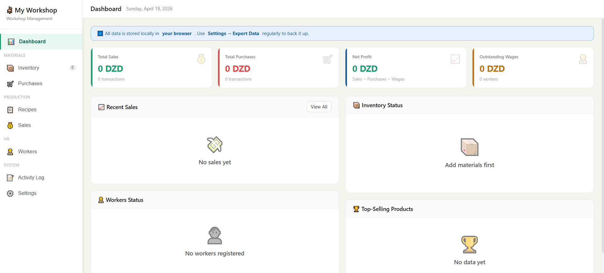
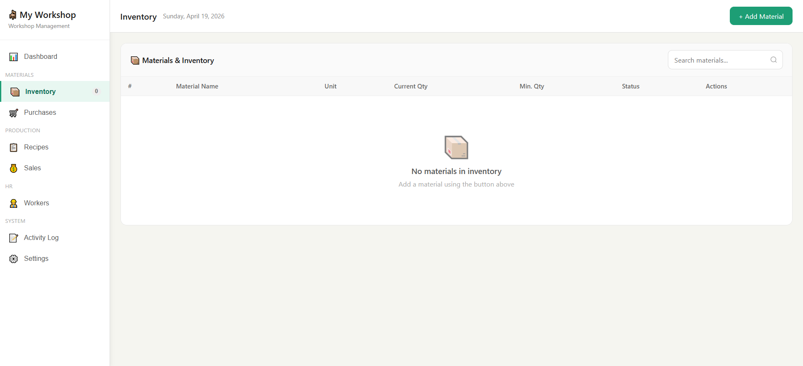
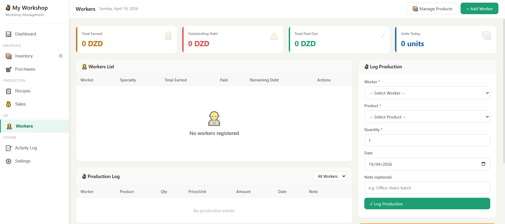

# 🪑 Workshop Manager

> A free, open-source, browser-based management system for small furniture workshops.

**No login. No server. No installation.** Open the file, start managing.

[](https://fatherrahmaneghoul.github.io/workshop-manager/)
[](LICENSE)

---

## What It Does

Workshop Manager tracks everything a small furniture workshop needs day-to-day:

- **📊 Dashboard** — Live overview: total sales, purchases, net profit, outstanding wages, and low-stock alerts
- **📦 Inventory** — Track raw materials with visual stock levels and low-stock thresholds
- **🛒 Purchases** — Log material purchases; stock updates automatically
- **📋 Product Recipes** — Define what materials are consumed per unit sold (bill of materials)
- **💰 Sales** — Record sales that auto-deduct materials from inventory
- **👷 Workers & Payroll** — Piecework-based pay system with partial payment support and debt tracking
- **📝 Activity Log** — Full audit trail of every action, filterable by category
- **💾 Backup & Restore** — Export all data to a JSON file and import it on any device

---

## How Data Is Stored

All data lives in your **browser's localStorage** — no account, no cloud, no server needed. This means:

- ✅ Works completely offline
- ✅ Nothing is shared or uploaded anywhere
- ✅ Instant — no loading, no latency
- ⚠️ Data is browser-specific — use **Export Data** regularly to back it up
- ⚠️ Clearing browser data will wipe the app — always keep a backup JSON

---

## Getting Started

### Option A — Use the live demo
Visit: `https://fatherrahmaneghoul.github.io/workshop-manager/`

### Option B — Run it locally
```bash
git clone https://github.com/fatherrahmaneghoul/workshop-manager.git
cd workshop-manager
# Just open index.html in any modern browser — no server needed
open index.html
```

That's it. No `npm install`, no build step, no dependencies.

---

## Tech Stack

| Layer     | Technology                  |
|-----------|-----------------------------|
| UI        | Vanilla HTML5, CSS3, JS     |
| Storage   | Browser localStorage        |
| Hosting   | GitHub Pages (static)       |
| Build     | None — zero tooling         |

The entire application is a single self-contained `index.html` file. This is an intentional design decision — it makes the project maximally portable and easy to audit.

---

## Project Structure

```
workshop-manager/
├── index.html     ← The entire application
└── README.md      ← This file
```

---

## Screenshots

### 📊 Dashboard


### 📦 Inventory


### 👷 Workers


---

## Workflow Guide (How to Use)

1. **Add your materials** → Inventory → Add Material (e.g. Pine Wood, 200 meters)
2. **Add your products** → Workers → Manage Products (e.g. Wooden Chair, 150 DZD/unit for workers)
3. **Create recipes** → Recipes → Add Recipe (e.g. Wooden Chair uses 2m wood, 1 box screws)
4. **Add your workers** → Workers → Add Worker
5. **Log purchases** → Purchases → Record Purchase (adds to stock automatically)
6. **Log sales** → Sales → Record Sale (deducts materials automatically)
7. **Log production** → Workers → Log Production (tracks what each worker made)
8. **Pay workers** → Workers → Pay Worker (partial payments supported)
9. **Back up your data** → Settings → Export Data (do this often!)

---

## Roadmap

- [ ] PDF receipt/report generation
- [ ] Monthly profit & loss charts
- [ ] PWA support (install as mobile app)
- [ ] Multi-language support (Arabic, French)
- [ ] Dark mode

Contributions welcome — open an issue or pull request.

---

## Contributing

1. Fork the repository
2. Create a feature branch: `git checkout -b feature/my-feature`
3. Commit your changes: `git commit -m 'Add: my feature'`
4. Push: `git push origin feature/my-feature`
5. Open a Pull Request

---

## License

MIT © [Fatherrahmane Ghoul](https://github.com/fatherrahmaneghoul)

Free to use, modify, and distribute.
